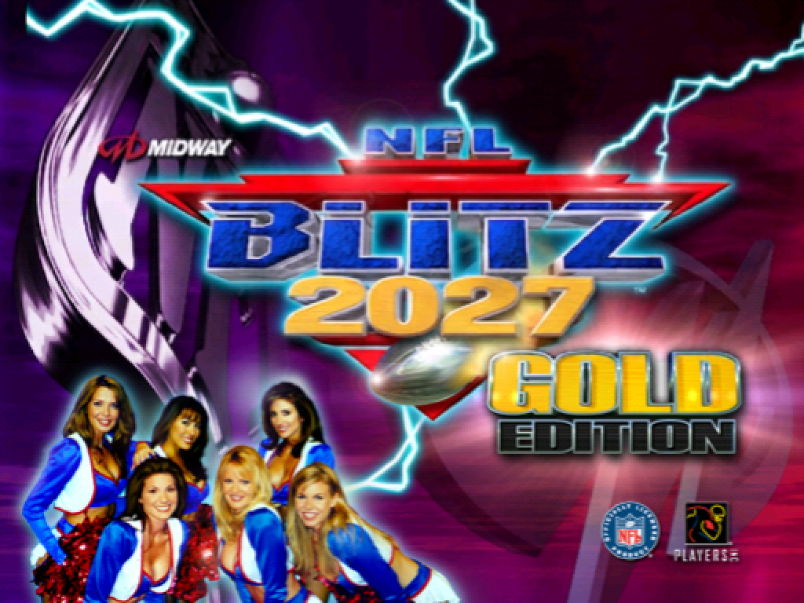
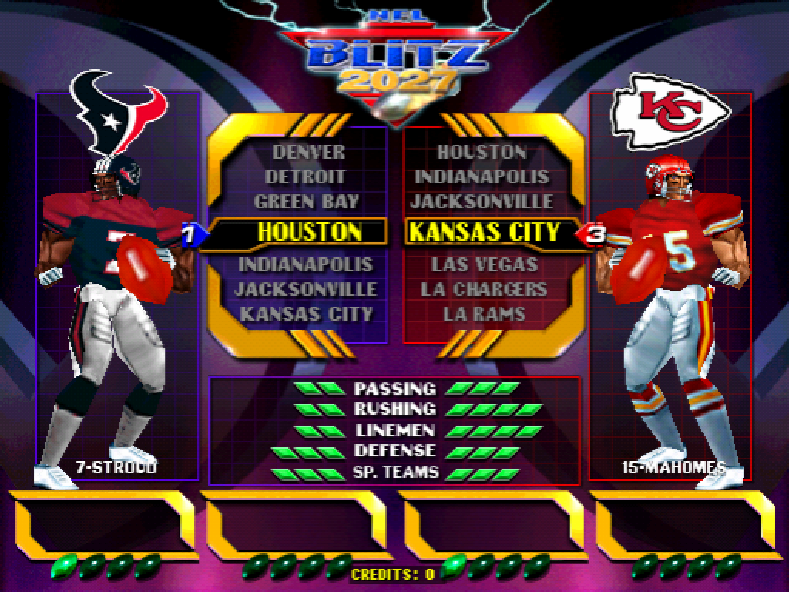
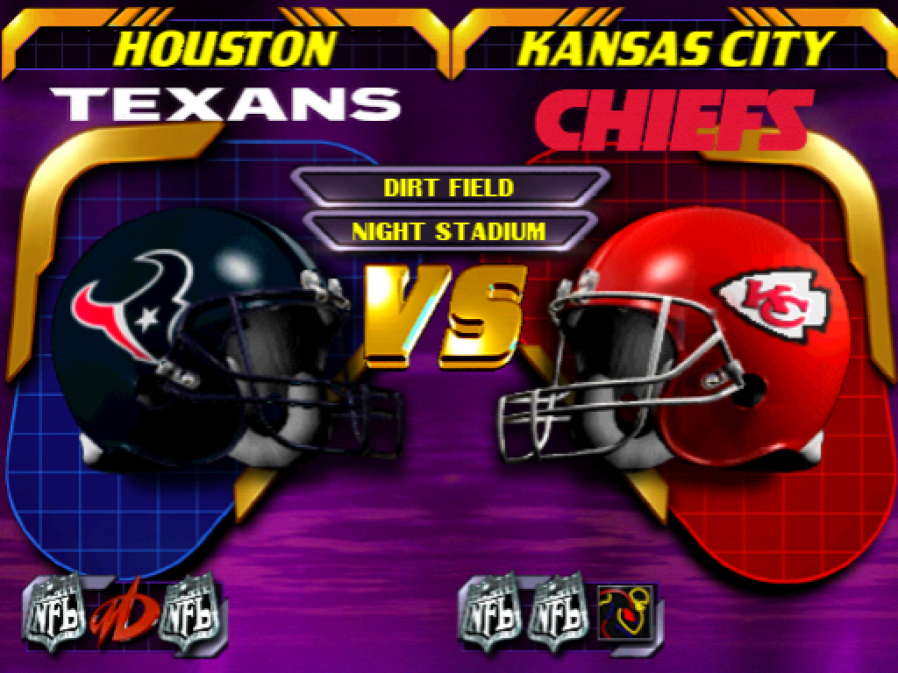
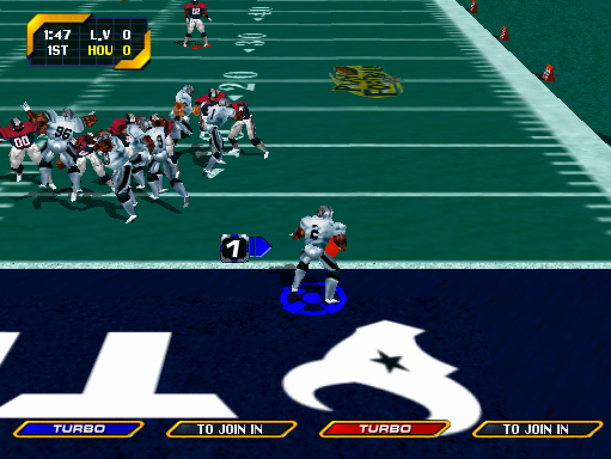
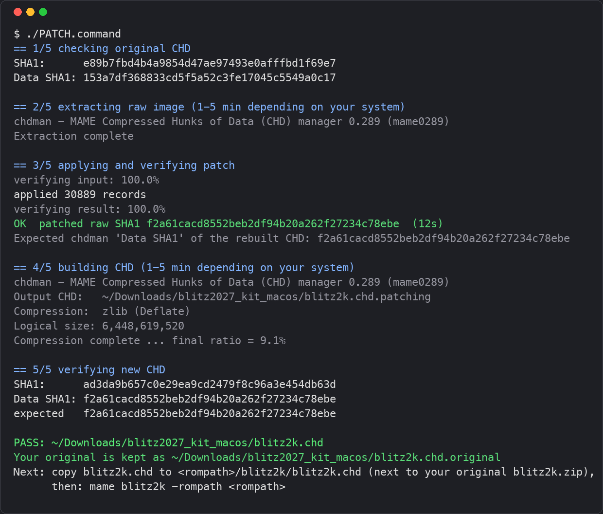

# NFL Blitz 2027

A community update of the arcade version of NFL Blitz 2000 Gold (Midway, 1999; MAME set blitz2k): all 32 NFL franchises, current rosters, modern team art and a re-recorded announcer.

**No game data here.** The release is a small patch you apply to your own copy of the original blitz2k.chd. You need the original disk image and ROM set; the patch won't work on anything else.

MAME set blitz2k, *NFL Blitz 2000 Gold Edition (ver 1.2, Sep 22 1999)*:

| File | What | Size | Checksum |
|---|---|---|---|
| blitz2k/blitz2k.chd | hard disk image (the file the patch rewrites) | 6.0 GB (CHD ~580 MB) | SHA1 `e89b7fbd4b4a9854d47ae97493e0afffbd1f69e7` |
| blitz2k.zip → bltz2k14.u32 | boot ROM v1.4 | 512 KB | CRC `ac4f0051` |
| blitz2k.zip → sound102.u95 | sound boot ROM | 32 KB | CRC `bec7d3ae` |
| blitz2k.zip → 494_blitz_2000.u96 | security PIC | 8 KB | CRC `f27b38a4` |

Only the CHD changes; keep your blitz2k.zip as is. Check yours with `chdman info -i blitz2k.chd` (the SHA1 line) and `mame -verifyroms blitz2k`. This repository holds the patcher and the tooling that builds the downloads.

Current release: **v1.0.0** (build 1006a)

## What's new since the original game
- **32 teams.** The Houston Texans join with their own roster, ratings, helmets, uniforms, end zone, wordmark and announcer bank.
- **Current rosters** for every team (nine named starters each, depth charts as of 2026-10-02) and a full team-strength rebalance.
- **Relocations and rebrands:** Las Vegas Raiders, Los Angeles Chargers, Los Angeles Rams, Washington Commanders.
- **Announcer re-recorded.** Every team name and about 300 player callouts re-recorded.
- **Modern art everywhere:** emblems, wordmarks, VS-screen and attract-mode helmets, uniforms, end zones, on-field name tags, win banners, title and feature screens.
- **End of game trivia rewritten:** 930 updated, fact-checked questions.

Full details: [CHANGELOG.md](CHANGELOG.md).

Questions and feedback: [the release thread on Arcade Controls](https://forum.arcadecontrols.com/index.php/topic,170487.0.html).

## Screenshots

| | |
|---|---|
|  |  |
|  |  |

## Installation

Takes 2 to 10 minutes depending on your system and needs about 13 GB of temporary disk space.

1. Download the patch for your platform from the [latest release](../../releases/latest).
2. Unzip it, put your original blitz2k.chd in the patch folder, then run the script for your system:
   - **Windows:** double-click PATCH.bat. Windows shows an "Open File - Security Warning" box (Unknown Publisher) because the patch is not code-signed; click *Run*.
   - **macOS:** double-click PATCH.command. The patch's programs are not notarized; see the macOS note under Notes below.
   - **Linux:** run ./patch.sh. x86-64 and arm64 are both in the one zip and the right one is selected automatically. Set CHDMAN=/path/to/chdman to use your own chdman.
3. Wait for **PASS**. The patch folder now holds the patched blitz2k.chd and your untouched original as blitz2k.chd.original (keep it; you need it for future versions). Copy the new blitz2k.chd into your MAME rompath's blitz2k folder, next to your unmodified blitz2k.zip, replacing the old one.

Expected result: CHD Data SHA1 `f2a61cacd8552beb2df94b20a262f27234c78ebe` (file MD5 `136779c93424c8352ac789c7738f8a28`).

A successful run ends like this:

## Notes
- **MAME checksum warning at boot is expected.** Press a key or launch with -skip_gameinfo. A modded disk can never match the driver's hash.
- **"DIFF CHD ERROR: Invalid parent".** Delete diff\blitz2k.dif in your MAME folder; it was created for the original disk.
- **macOS "cannot be opened" warning.** The patch's programs are not notarized with Apple. PATCH.command clears the download flag itself, so normally nothing is needed; if macOS still blocks it, right-click PATCH.command and choose Open once.

## Build the patcher from source
Requires Go.

    cd dist/go
    go build -o ../../out/blitzpatch .

Cross-compile with GOOS/GOARCH as needed. The Python reference tools (make_patch.py, apply_patch.py, bpz_format.py) use only the standard library (Python 3.8+).

## Build the patch downloads
    dist/build_kits.sh

Needs go, zip and (on macOS) lipo. The patch (blitz2027.bpz) and the vendored chdman binaries ([vendor/](vendor/README.md)) are in the repository; the zips are written to out/ (git-ignored).

## Licence and credits
- Code (patcher and tooling): Apache-2.0, see [LICENSE](LICENSE).
- The patch file, artwork and audio are **not** covered by that licence: personal, non-commercial use only, see [DATA_NOTICE.md](DATA_NOTICE.md).
- Bundled chdman is unmodified MAME 0.289 (GPL v2+), see [vendor](vendor/README.md).
- NFL Blitz and the NFL marks are trademarks of their owners; this is a fan project and distributes no copyrighted game content. Announcer voice generated with ElevenLabs.
